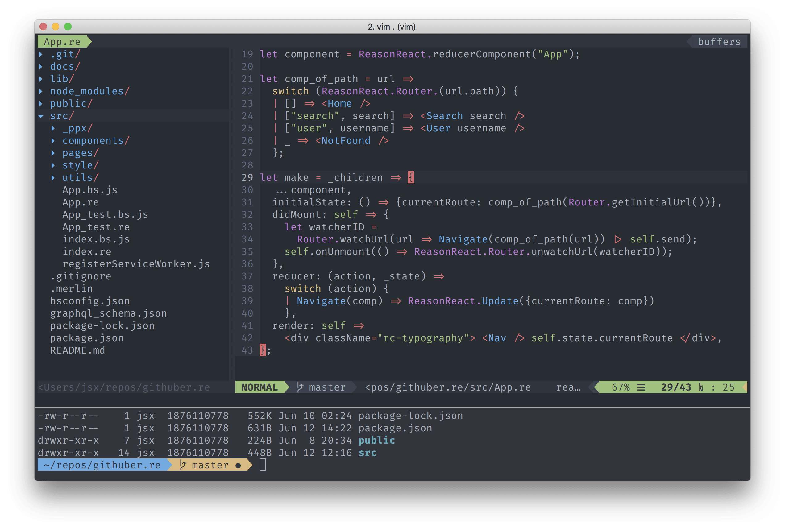
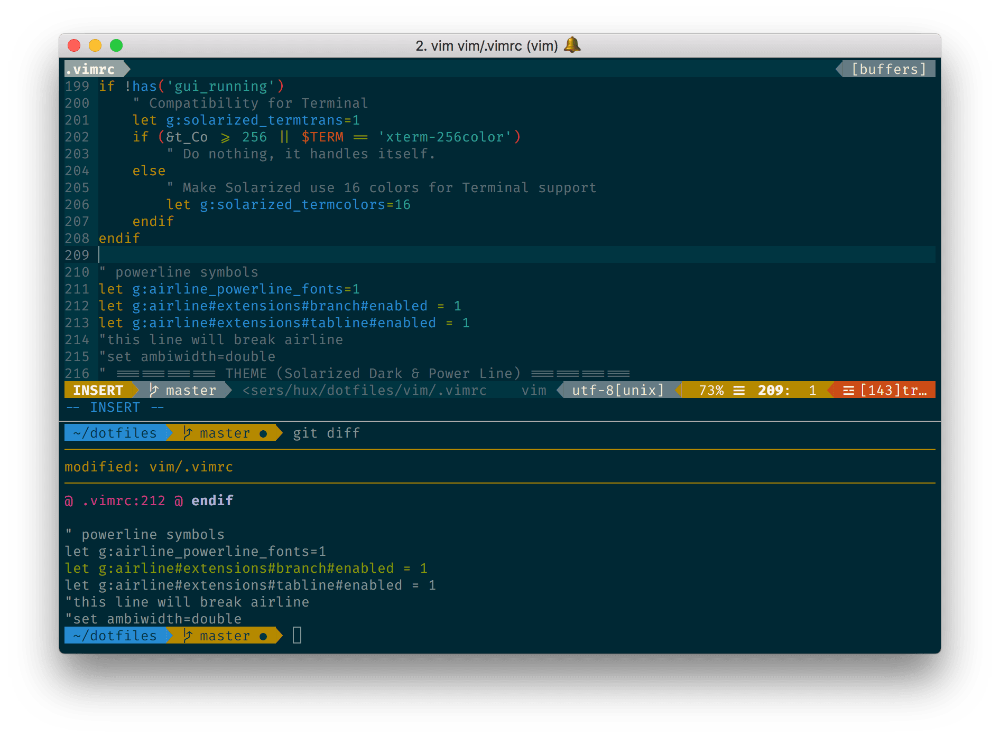
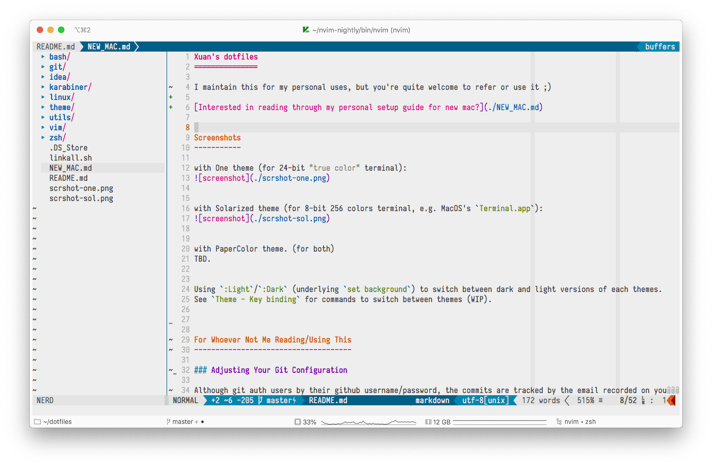

Xuan's dotfiles
===============

I maintained this for my personal use, but you're welcome to borrow any part of it ;)

My personal setup instructions for a [💻 new mac](./NEW_MAC.md) or [☁️  new server](./NEW_SERVER.md).


🎨 Screenshots
--------------

> Each theme can be toggled between its light and dark variants via `:Light` and `:Dark` commands.
> 
> Personally, I prefer the light mode of the _PaperColor_ and the dark mode of the _One_.

The _One_ theme (only working on 24-bit *true color* terminal):


The _Solarized_ theme (only working on 8-bit 256 colors terminal, e.g. MacOS's `Terminal.app`):


The _PaperColor_ theme. (working on both)



⚠️ For Whoever Not Me Reading/Using This
---------------------------------------

### Amend the Git configuration!

Although git auth users by their github username/password, the commits are tracked by the email recorded on your local `git config`. Please follow [Why are my commits linked to the wrong user?
](https://help.github.com/en/github/committing-changes-to-your-project/why-are-my-commits-linked-to-the-wrong-user) to change the email:

```sh
$ git config --global user.email "email@example.com"
```


References
----------

This dotfiles shamelessly borrow a lot from the web. (Thx, the internet!)

* <https://dotfiles.github.io/>
* <https://github.com/nicksp/dotfiles>
* <https://github.com/necolas/dotfiles>
* <https://github.com/paulirish/dotfiles>
