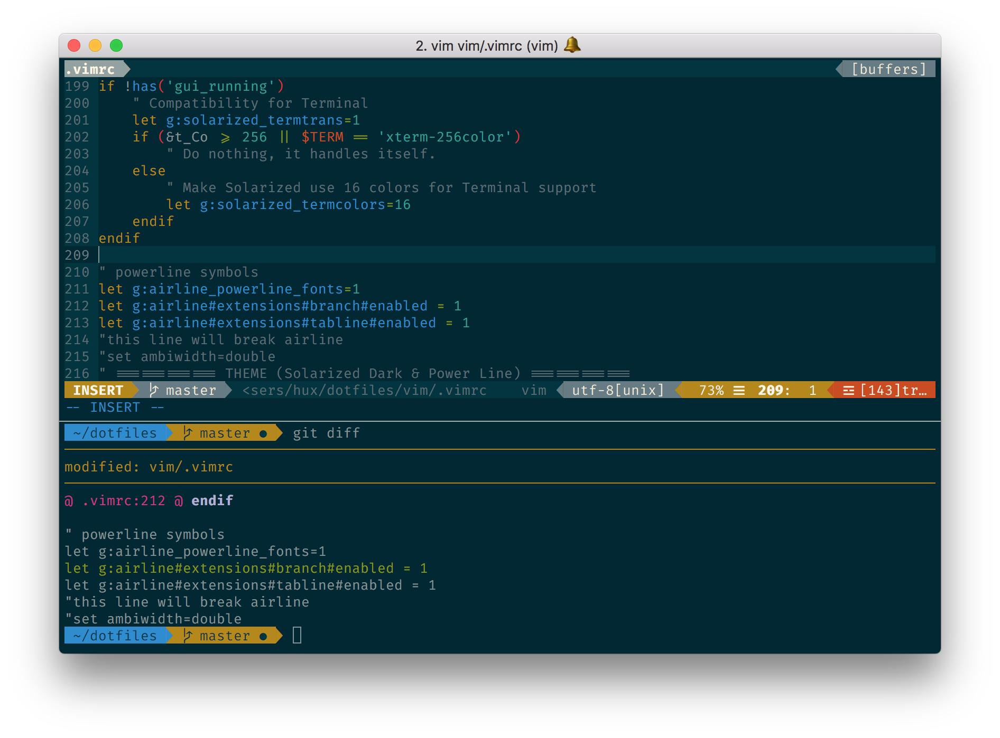

# Xuan's dotfiles


I maintain this for my very personal use, but you're quite welcome to refer it, use it, and make suggestions.

## Screenshot



## Dependencies

Vundle (for vim plugin management)
  * `git clone https://github.com/VundleVim/Vundle.vim.git ~/.vim/bundle/Vundle.vim`
  * `:PluginInstall` in vim

[Oh-my-zsh](https://github.com/robbyrussell/oh-my-zsh) (pre-configured ZShell)
  * `sh -c "$(curl -fsSL https://raw.githubusercontent.com/robbyrussell/oh-my-zsh/master/tools/install.sh)"`

Solarized Theme
  * I include `.itermcolor` in `/theme` for ITerm users

Fira Fonts (if you like this)


## Protips

Use `symlink` rather than hard copies!

```bash
$ ln -s <source_file> <target_file>

# use my linkall.sh (under repo's dir)
$ sh linkall.sh

# e.g. (under $HOME)
$ ln -s dotfiles/vim/.vimrc .vimrc
```

## MacOS Tools

* <https://github.com/sindresorhus/quick-look-plugins>

## Reference

This dotfiles shamelessly borrow a lot from the web. (Thx, the internet!)

You can also find plenty of dotfiles from:

* <https://dotfiles.github.io/>
* <https://github.com/nicksp/dotfiles>
* <https://github.com/necolas/dotfiles>
* <https://github.com/paulirish/dotfiles>
