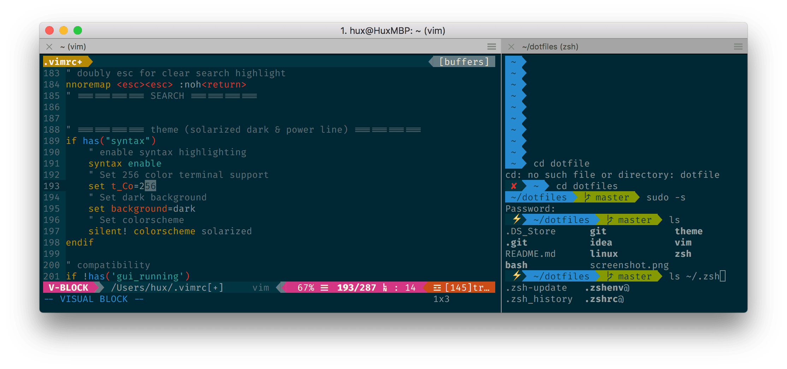

# Xuan's dotfiles


I maintain this for my very personal use, but you're quite welcome to refer it, use it, and make suggestions.

### Screenshot



### Protips

Use `symlink` rather than hard copies!

```bash
$ ln -s <source_file> <target_file> 

# e.g. (if you were under $HOME)
$ ln -s dotfiles/vim/.vimrc .vimrc
```

### Reference

This dotfiles shamelessly borrow a lot from the web. (Thx, the internet!)

You can also find plenty of dotfiles from:

* <https://dotfiles.github.io/>
* <https://github.com/nicksp/dotfiles>
* <https://github.com/necolas/dotfiles>
* <https://github.com/paulirish/dotfiles>

