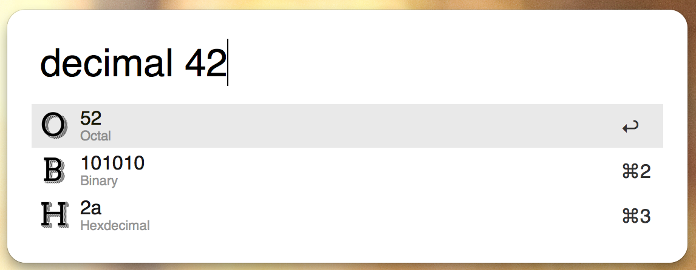

# NSC
*Number System Converter -- an [Alfred](http://www.alfredapp.com/) extension*
* * *

**Author:** [Hans-Helge B&uuml;rger](http://www.hanshelgebuerger.de "Hans-Helge Bürger - Webpage")
**Date:** 29. March 2017
**Version:** v2.4
**Licence:** [Attribution 3.0 Unported (CC BY 3.0)](http://creativecommons.org/licenses/by/3.0/ "Attribution 3.0 Unported (CC BY 3.0)")

## Quick Installation
### Download [NSC v2.4](https://github.com/obstschale/NSC/raw/alfredextension/nsc-v2.4.alfredworkflow)

---
## Introduction

*NSC* is a little [Alfred](http://www.alfredapp.com/) workflow to convert a number into another number system. I study computer science and therefore I daily deal with different number systems. The most common ones are probably `binary`, `octal`, `decimal`, and `hexadecimal` but I got tiered to calculate them by hand, calculator or a webpage. Alfred is only a key stroke away and so I started programming this workflow.

I started to learn Python and to pratice that the new Alfred 2 workflow is written in Python insteed of PHP. You know, only if you use a language you get better ;) So your welcome to send a pull request if you have any improvement done.

## Functions

Like I mentioned above, you can convert numbers. In the first version I implemented `binary`, `decimal`, and `hexadecimal`. And you can even convert any number from any system into another. But be warned: I didn't implemented a _letter-replacement-function_ which would display the number _10_ with an _A_. I will definitely do this soon, but in this first version I had other problems (especially to get started with Python :) )

## Usage

But how can I use NSC? It is really simple.

You call NSC with the different keywords (this is new in v2.0) and according the number you want to convert. E.g. if you want to convert a decimal number you just type `decimal` and the `number`. Alfred 2 will show instantly the converted number in `binary`, `octal`, and even `hex`.

So the 4 basic keywords are:

* `decimal`
* `binary`
* `octal`
* `hex`

and it looks like that:

I really love this feature, displaying live updates in Alfred :)

Beside these 4 keywords a fifth is implemented: `convert`. It is used if a number needs to be converted which is no to base 2, 8, 10 or 16. It uses the following syntax:

	`convert` `number` `base of number` `base of new system`

Imagine it like a sentence: _Convert number X with base B into system with base Y_

_Convert 42 with base 6 into system with base 4_

### Clipboard and Notification
Another cool feature of Alfred 2 is that you can pass arguments to other parts of your workflow. In case of NSC, if you select a result and click `enter`, the number will be copied to your clipboard and a notification will pop up.

### Examples

* `decimal 10` → result: B: 1010 // O: 12 // H: a

* `binary 1011` → result: D: 11 // O: 13 // H: b

* `octal 150` → result: D: 104 // B: 1101000 // H: 68

* `hex FF2` → result: D: 4082 // B: 111111110010 // O: 7762

* `convert 119 11 3` → result: D: 141 // Base 3: 12020

---

## Changelog
### v2.4
* enhancement: add version to `info.plist`. Props to @bbezanson #5 #6

### v2.3
* add: `+` and `/` to alphabeth for converting up to base 64. Props to @sycrat #4

### v2.2
* add: display binary numbers w/ at least 8 digits
* add: display hex in uppercase
thx to [akupila](https://github.com/akupila)

### v.2.1
* add: conversion upto base 62 (case-sensitive letters if base is greater than 35)
* add: add info.plist to repo
* add: all scripts uses now [alp](https://github.com/phyllisstein/alp) to generate XML feedback

### v2.01
* bug: base 1 led into an infinite loop (thx to [@kevinlsw](https://github.com/kevinlsw) | [#2](https://github.com/obstschale/NSC/issues/2))
* add: new int2base function which uses now letters as input/output within `convert`
* add: NSC uses [alp](https://github.com/phyllisstein/alp) to generate XML feedback

### v2.0
* NSC is now an Alfred Workflow and works with Alfred 2
* add: convert from/into decimal, binary, octal, hex
* add: new keywords `decimal`, `binary`, `octal`, `hex` and `convert`
* add: update made easy with [Alleyoop](http://www.alfredforum.com/topic/1582-alleyoop-update-alfred-workflows/)
* change GitHub link

### v1.4
* add: support for [updater extension](http://jdfwarrior.tumblr.com/updater)

### v1.3
* bug: minor bugfixes
* add: display letters if digits larger than 10

### v1.2
* add: convert to `decimal` with an own function
* add: convert from `decimal` to other number system upto base 35

### v1.1
* add: convert between `binary`, `deciaml`, and  `hexadeciaml` with PHP builtin functions

### v1.0
* first version of NSC
* add: can convert from `decimal` to `binary` and `hexadecimal` with PHP builtin functions

## Roadmap
* convert floating numbers

---
## Licensing

I'm a huge fan of *CreativeCommons* and so it's my first choice for licensing. I choose the [**CC BY 3.0**](http://creativecommons.org/licenses/by/3.0/ "Attribution 3.0 Unported (CC BY 3.0)") so you can use it for free. It's also allowed to adapt the work, for an own tutorial or a new game. But if you use it link to the tutorial.
